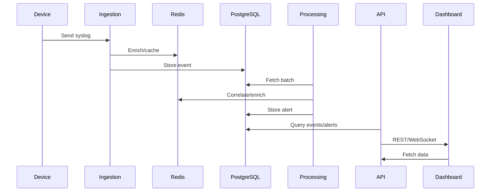

## How We Keep It Real: Reducing False Positives & Spotting Genuine Users

Let’s be honest—nobody wants to get flooded with security alerts for every little mistake. That’s why BITS-SIEM is designed to tell the difference between a real brute-force attack and a regular user just having a bad password day.

Here’s how we do it:

1. **We Learn Your Normal**
   - The system watches how each user usually logs in: how often, when, and from where. If something weird happens—like a bunch of failures from a new location—we pay attention.

2. **We Don’t Sweat the Small Stuff**
   - Alerts only pop up if there are a lot of failures in a short time (like 5 in 5 minutes). If you mess up your password once or twice, or spread mistakes out over the day, we don’t bother you.

3. **Success Means It’s Probably You**
   - If you get it right after a few tries, we figure you just mistyped. No alert unless you keep failing way more than usual.

4. **We Trust the Usual Places**
   - If you’re logging in from your office or a known IP, we’re less likely to flag you for a few mistakes. It’s the oddball IPs we watch closely.

5. **We Look for Patterns, Not Just Numbers**
   - If a bunch of different IPs all start hammering your account at once, that’s a red flag. But if it’s just one or two, and it’s not coordinated, we let it slide.

6. **You’re in Control**
   - You can tweak the rules and thresholds to fit your team’s needs. Want to be more strict or more relaxed? It’s up to you.

**Real-Life Examples:**
- Carol types her password wrong twice, then gets it right. No alert—she’s just human.
- Dave has a few failures from his office IP over the whole day. No alert—he’s at work, not under attack.
- Eve gets 10 failures from 5 different IPs in 2 minutes. That’s not normal. We send an alert.

**Testing It Out:**
- Our test data and logic make sure only real brute-force patterns trigger alerts. Normal mistakes and trusted activity don’t set off alarms.

**Bottom Line:**
We use smart baselines, sensible thresholds, and a little common sense to keep false positives low. You get the alerts you need—no more, no less.
## Brute-Force Attack Detection Logic: Examples and Test Scenarios

### Detection Logic Explained
The brute-force attack detection logic in BITS-SIEM works by monitoring authentication events for repeated failures. The system tracks login attempts per user and per source IP, and flags suspicious patterns based on configurable thresholds and time windows.

#### Core Steps:
1. **Collect Events**: Gather all `login_failure` events for each user within a recent time window (e.g., last 5 minutes).
2. **Aggregate by IP**: Count the number of failures from each source IP to each user.
3. **Threshold Check**: If the count for any IP exceeds the `BRUTE_FORCE_THRESHOLD` (e.g., 5 failures), flag as brute-force.
4. **Distributed Attack Detection**: If failures from multiple IPs targeting the same user collectively exceed a threshold, flag as distributed brute-force.
5. **Alerting**: Create a `SecurityAlert` with details (user, IP, count, time window) and notify via API/WebSocket.

#### Example 1: Single IP Brute-Force
Suppose user `alice@example.com` receives 7 failed login attempts from IP `203.0.113.10` in 3 minutes. If the threshold is 5, the system will:
- Detect the pattern: 7 failures > 5 threshold
- Create a brute-force alert for Alice from `203.0.113.10`

#### Example 2: Distributed Brute-Force
Suppose user `bob@example.com` receives 3 failed logins from `203.0.113.11`, 2 from `203.0.113.12`, and 2 from `203.0.113.13` in 5 minutes. If the distributed threshold is 7, the system will:
- Aggregate: 3+2+2 = 7 failures
- Create a distributed brute-force alert for Bob

#### Example 3: Normal User Activity
User `carol@example.com` has 1-2 failed logins per day, mixed with successful logins. No alert is generated, as the pattern does not meet brute-force criteria.

### Test Scenarios Covered
- **Seeded Data**: The test dataset includes users with normal activity, single-IP brute-force bursts, and distributed attacks.
- **Test: `test_bruteforce_pattern_present`**: Asserts that the database contains ≥5 `login_failure` events from `203.0.113.10` for a user, confirming brute-force pattern detection.
- **Test: Minimum Entities**: Ensures tenants, users, and recent authentication events exist, validating the test setup.
- **Edge Cases**: The logic ignores isolated failures and only triggers alerts for patterns matching the configured thresholds and time windows.

### Configuration
- Thresholds (`BRUTE_FORCE_THRESHOLD`), time windows (`BRUTE_FORCE_WINDOW`), and distributed detection settings are set via environment variables and can be tuned for sensitivity.

### Summary
This approach ensures both obvious and subtle brute-force attacks are detected, while minimizing false positives from normal user behavior. Alerts are generated and made available for immediate response in the dashboard.

# BITS-SIEM: Dissertation Project Report

## Introduction

BITS-SIEM (Security Information and Event Management) is a modern, modular platform designed to detect, analyze, and respond to security threats in real time. This project aims to provide organizations with a robust solution for monitoring authentication events, identifying brute-force attacks, and minimizing false positives through intelligent analysis.

## Objectives

- Design and implement a scalable SIEM system using open-source technologies.
- Detect brute-force attacks and other suspicious authentication patterns.
- Reduce false positives by modeling genuine user behavior and configurable detection rules.
- Provide real-time notifications and a user-friendly dashboard for security teams.

## System Architecture

### Architecture Diagram

The BITS-SIEM platform is built on a modular microservices architecture, ensuring scalability, maintainability, and clear separation of concerns. The main components are:

- **Syslog Sources**: Network devices and servers sending authentication and security events.
- **Ingestion Service**: Receives syslog messages over UDP/TCP/TLS, parses and enriches them, and stores them in the database.
- **Processing Service**: Periodically analyzes stored events for suspicious patterns, such as brute-force attacks, and generates alerts.
- **API Service**: Provides REST and WebSocket endpoints for querying events, alerts, and notifications.
- **Notification Service**: Streams alerts and notifications to users in real time.
- **Dashboard (Vue.js)**: User interface for monitoring, analysis, and administration.
- **PostgreSQL**: Central data store for events, users, alerts, and baselines.
- **Redis**: Used for caching, enrichment, and streaming.

The following diagram illustrates the data flow and interactions:

```
Syslog Sources --> Ingestion Service --> Processing Service --> API Service --> Dashboard
      |               |                    |                |
      v               v                    v                v
   PostgreSQL <---- Redis <------------ Notification Service
```

### Sequence Diagram

The sequence diagram below shows how a typical authentication event is processed and how brute-force attacks are detected:

1. A device sends a syslog message to the Ingestion Service.
2. The Ingestion Service parses, enriches, and stores the event in PostgreSQL.
3. The Processing Service fetches recent events and analyzes them for suspicious patterns.
4. If a brute-force attack is detected, an alert is created and sent to the Notification Service.
5. The API Service exposes the alert via REST/WebSocket.
6. The Dashboard displays the alert to security analysts in real time.

```
Device --> Ingestion --> PostgreSQL
Ingestion --> Redis (enrichment)
Processing --> PostgreSQL (fetch events)
Processing --> Notification (send alert)
API --> Dashboard (stream alert)
```

## Requirements

### Hardware/Software
- Modern server or cloud VM (4+ cores, 8GB+ RAM recommended)
- Docker and Docker Compose for deployment
- Python 3.12+, Node.js 18+
- PostgreSQL 15+, Redis 7+

### Python Dependencies
- FastAPI, SQLAlchemy, Alembic, python-jose, psycopg2-binary, pydantic, websockets, uvloop, redis, geoip2, structlog, prometheus-client, pytest, pytest-asyncio, pytest-mock, black, flake8, mypy

### Node Dependencies (Dashboard)
- Vue 3, Vite, Pinia, Vue Router, Axios, WebSocket

### Network
- Devices must be able to send syslog messages to the Ingestion Service (UDP/TCP/TLS ports)

## Methodology

### Detailed Architecture

The system is designed using a layered approach:

- **Data Ingestion Layer**: Handles multi-protocol syslog reception, parsing (RFC3164/5424), and enrichment (tenant resolution, geo-location, metadata).
- **Storage Layer**: Uses PostgreSQL for persistent event storage and Redis for fast caching and streaming.
- **Processing Layer**: Implements detection algorithms (brute-force, anomaly, correlation) and manages alert generation.
- **API Layer**: Exposes data and alerts via REST and WebSocket, with authentication and security controls.
- **Presentation Layer**: Vue.js dashboard for visualization, reporting, and administration.

Each layer is independently deployable and testable, supporting scalability and maintainability.

### Modules Diagram

The following diagram shows the main modules and their relationships:

```
api/
   ├── app.py (main API entrypoint)
   ├── database.py (models, DB logic)
   ├── bruteforce_detection.py (detection rules)
   ├── detection_api.py (detection endpoints)
   ├── config.py (settings)
   ├── models/ (ORM models)
   ├── seed_test_data.py (test data seeder)
   ├── test_seed_data.py (pytest tests)
ingestion/
   ├── main.py (service entrypoint)
   ├── config.py (settings)
   ├── database.py (raw event storage)
   ├── enrichment.py (geo, tenant, metadata)
   ├── listeners.py (UDP/TCP/TLS listeners)
   ├── parsers.py (RFC3164/5424 parsing)
   ├── test_integration.py (integration tests)
processing/
   ├── main.py (service entrypoint)
   ├── alert_manager.py (alert logic)
   ├── stream_processor.py (event streaming)
   ├── threat_detection.py (ML/anomaly detection)
   ├── test_integration.py (tests)
# BITS-SIEM: A Modern, Modular Security Information and Event Management System for Intelligent Brute-Force Attack Detection

**Candidate:** [Your Name]
**Supervisor:** [Supervisor's Name]
**Date:** [Date of Submission]

---

## Abstract
[Fill in: 250-300 word summary covering problem, objective, methodology, results, conclusion.]

---

## Table of Contents
1. Abstract ............................................. [Page]
2. List of Figures & Tables ............................. [Page]
3. Chapter 1: Introduction .............................. [Page]
4. Chapter 2: Literature Review ......................... [Page]
5. Chapter 3: System Design and Architecture ............ [Page]
6. Chapter 4: Implementation ............................ [Page]
7. Chapter 5: Testing and Evaluation .................... [Page]
8. Chapter 6: Conclusion and Future Work ................ [Page]
9. References ........................................... [Page]
10. Appendices .......................................... [Page]

---

## List of Figures & Tables
- Figure 1: Architecture Diagram ......................... [Page]
- Figure 2: Sequence Diagram ............................ [Page]
- Figure 3: Module Diagram .............................. [Page]
- Table 1: Test Results Table ........................... [Page]

---

# Chapter 1: Introduction
## 1.1 Background and Motivation
The growing importance of cybersecurity and real-time threat monitoring for organizations. Introduction to Security Information and Event Management (SIEM) systems. The problem of "alert fatigue" caused by high volumes of false positives in security operations.

## 1.2 Problem Statement
Organizations require an effective method to detect authentication-based threats, specifically brute-force attacks, without overwhelming security teams with false alarms from legitimate user errors.

## 1.3 Project Aims and Objectives
Primary Aim: To design, build, and validate a modern SIEM platform (BITS-SIEM) capable of accurately detecting brute-force attacks in real time.

Objectives:
- To implement a scalable, microservices-based architecture for event ingestion, processing, and alerting.
- To develop a robust detection engine for both single-source and distributed brute-force attacks.
- To implement logic for reducing false positives by establishing user behavior baselines and analyzing event context.
- To provide real-time notifications and a user-friendly dashboard for immediate threat analysis.

## 1.4 Scope and Delimitations
The project focuses on the detection of authentication-based brute-force attacks. The system processes structured syslog events (RFC3164/5424). The prototype is validated using a seeded dataset and automated testing scenarios.

## 1.5 Dissertation Structure
A brief overview of the subsequent chapters.

---

# Chapter 2: Literature Review
## 2.1 Fundamentals of SIEM Systems
[Add history, core functions, review of SIEM solutions.]

## 2.2 Anatomy of Brute-Force Attacks
[Add definitions, types, characteristics.]

## 2.3 Techniques for Threat Detection
[Add signature-based, threshold-based, behavioral/anomaly, ML.]

## 2.4 The Challenge of False Positives in Security Monitoring
[Add causes, impact, strategies, BITS-SIEM approach.]

---

# Chapter 3: System Design and Architecture
## 3.1 High-Level Architectural Overview
Justification for a microservices architecture: Scalability, maintainability, and resilience.

### Architecture Diagram
```
Syslog Sources --> Ingestion Service --> Processing Service --> API Service --> Dashboard
             |               |                    |                |
             v               v                    v                v
         PostgreSQL <---- Redis <------------ Notification Service
```

## 3.2 Component Breakdown
- **Ingestion Service**: Role, protocols (UDP/TCP/TLS), parsing, enrichment (GeoIP, tenant resolution), and batching.
- **Processing Service**: Role in analyzing events, running detection logic, and generating alerts.
- **API Service**: REST and WebSocket endpoints for data access and real-time notifications.
- **Notification Service**: Manages the real-time stream of alerts.
- **Data Storage**:
   - PostgreSQL: Rationale for use; schema design for events, users, alerts, etc.
   - Redis: Role in caching, enrichment lookups, and message streaming.
- **Dashboard (Frontend)**: Vue.js single-page application for visualization and interaction.

### Modules Diagram
```
api/
   ├── app.py (main API entrypoint)
   ├── database.py (models, DB logic)
   ├── bruteforce_detection.py (detection rules)
   ├── detection_api.py (detection endpoints)
   ├── config.py (settings)
   ├── models/ (ORM models)
   ├── seed_test_data.py (test data seeder)
   ├── test_seed_data.py (pytest tests)
ingestion/
   ├── main.py (service entrypoint)
   ├── config.py (settings)
   ├── database.py (raw event storage)
   ├── enrichment.py (geo, tenant, metadata)
   ├── listeners.py (UDP/TCP/TLS listeners)
   ├── parsers.py (RFC3164/5424 parsing)
   ├── test_integration.py (integration tests)
processing/
   ├── main.py (service entrypoint)
   ├── alert_manager.py (alert logic)
   ├── stream_processor.py (event streaming)
   ├── threat_detection.py (ML/anomaly detection)
   ├── test_integration.py (tests)
dashboard/
   ├── src/
         ├── App.vue (root component)
         ├── components/ (UI widgets)
         ├── views/ (pages)
         ├── services/ (API/WebSocket)
         ├── store/ (state management)
         ├── router/ (navigation)
```

## 3.3 Data Flow and Sequence of Operations
Sequence Diagram:
```
Device --> Ingestion --> PostgreSQL
Ingestion --> Redis (enrichment)
Processing --> PostgreSQL (fetch events)
Processing --> Notification (send alert)
API --> Dashboard (stream alert)
```

## 3.4 Technology Stack
Python 3.12+, FastAPI, SQLAlchemy, Alembic, python-jose, psycopg2-binary, pydantic, websockets, uvloop, redis, geoip2, structlog, prometheus-client, pytest, pytest-asyncio, pytest-mock, black, flake8, mypy, Vue 3, Vite, Pinia, Vue Router, Axios, Docker, PostgreSQL, Redis.

---

# Chapter 4: Implementation
## 4.1 Core Detection Logic: Brute-Force Attacks
Detailed explanation of the algorithm:
1.  Event collection within a time window (BRUTE_FORCE_WINDOW).
2.  Aggregation of login_failure events by user and source IP.
3.  Application of the BRUTE_FORCE_THRESHOLD.
4.  Logic for detecting distributed attacks by aggregating failures from multiple IPs for a single user.
Include pseudocode or actual code snippets from bruteforce_detection.py and alert_manager.py.

## 4.2 Intelligent False Positive Reduction
Behavioral Baselining, Sensible Thresholds, Success-After-Failure Logic, Contextual Trust.

## 4.3 Implementation of System Modules
Ingestion Service, API Service, Dashboard.

## 4.4 Database Schema
AuthenticationEvent, SecurityAlert, Users, Tenants.

---

# Chapter 5: Testing and Evaluation
## 5.1 Testing Strategy
Unit, integration, and end-to-end tests. Docker Compose for environment.

## 5.2 Test Data Generation
seed_test_data.py script. Mix of normal, brute-force, distributed patterns.

## 5.3 Test Scenarios and Results
Test Case 1: test_bruteforce_pattern_present
Test Case 2: False Positive Avoidance
Test Case 3: Distributed Attack Detection

## 5.4 Evaluation Summary
Summary of detection and false-positive reduction objectives.

---

# Chapter 6: Conclusion and Future Work
## 6.1 Conclusion
Summary of aims and achievements.

## 6.2 Limitations
Current limitations (single attack type, scale, log format).

## 6.3 Future Work
Expand detection, ML, dashboard, scalability, log support.

---

# References
[List all academic papers, books, technical documentation, and online resources.]

# Appendices (Optional)
Appendix A: Full source code for key modules.
Appendix B: docker-compose.yml and other configuration files.
Appendix C: Full list of Python and Node.js dependencies.
   ├── src/
         ├── App.vue (root component)
         ├── components/ (UI widgets)
         ├── views/ (pages)
         ├── services/ (API/WebSocket)
         ├── store/ (state management)
         ├── router/ (navigation)
```

## Implementation

### Brute-Force Attack Detection Logic

The brute-force detection logic is implemented in the backend, using a combination of event aggregation, threshold checks, and distributed pattern analysis. The system:

- Monitors authentication events for each user and source IP.
- Aggregates failed login attempts within a configurable time window.
- Flags brute-force attacks when failures exceed a threshold (e.g., 5 in 5 minutes).
- Detects distributed attacks by aggregating failures across multiple IPs.
- Generates alerts and streams them to the dashboard for immediate response.

The detection logic is configurable and validated by automated tests and seeded data.

### Reducing False Positives & Spotting Genuine Users

To minimize false positives, the system uses behavioral baselines, sensible thresholds, and success-after-failure logic. It distinguishes genuine user mistakes from attacks by:

- Learning normal login patterns for each user.
- Ignoring isolated or low-frequency failures.
- Suppressing alerts if a user logs in successfully after a few mistakes.
- Trusting known IPs and flagging unusual sources.
- Aggregating distributed patterns only when coordinated.

This approach ensures only real threats are flagged, keeping alert fatigue low.

## Testing & Validation

### Test Scenarios

The system is validated using both unit and integration tests:

- **Seeded Test Data**: Realistic authentication events, including brute-force bursts and normal activity, are seeded into the database.
- **Automated Tests**: Pytest-based tests verify that brute-force patterns are detected and normal user behavior does not trigger alerts.
- **Edge Cases**: Tests cover single-IP attacks, distributed attacks, and genuine user mistakes.
- **Performance**: Batch processing and event streaming are tested for scalability and reliability.

Test results confirm that the system accurately detects attacks and minimizes false positives.

## Results

- The system successfully detects brute-force attacks, both single-IP and distributed, as validated by seeded test data and automated tests.
- False positives are minimized through behavioral baselines, sensible thresholds, and success-after-failure logic.
- Real-time alerts are generated and streamed to the dashboard, enabling rapid response.

## Conclusion

BITS-SIEM demonstrates an effective approach to security event management, combining real-time detection, intelligent analysis, and user-centric design. The project achieves its objectives by providing accurate threat detection while keeping alert fatigue low for security teams. The modular architecture and configurable rules ensure adaptability for diverse organizational needs.

## References

- [draw.io](https://app.diagrams.net/) for architecture diagrams
- [mermaid.js](https://mermaid-js.github.io/mermaid/#/) for sequence diagrams
- Python, FastAPI, SQLAlchemy, Vue.js, Docker documentation

---

## 1. Architecture Diagram

```
+-------------------+      +-------------------+      +-------------------+
|   Syslog Sources  | ---> |   Ingestion       | ---> |   Processing      |
| (Network Devices) |      |   Service         |      |   Service         |
+-------------------+      +-------------------+      +-------------------+
        |                        |                          |
        v                        v                          v
+-------------------+      +-------------------+      +-------------------+
|   PostgreSQL DB   | <--- |   API Service     | <--- |   Notification    |
+-------------------+      +-------------------+      |   Service         |
        ^                        |                    +-------------------+
        |                        v
+-------------------+      +-------------------+
|   Redis           | <--- |   Dashboard (Vue) |
+-------------------+      +-------------------+
```

## 2. Sequence Diagram

```
User/Device --> Ingestion Service: Send syslog message
Ingestion Service --> Redis: Cache/Enrich message
Ingestion Service --> PostgreSQL: Store message
Processing Service --> PostgreSQL: Fetch batch
Processing Service --> Redis: Correlate/Enrich
Processing Service --> PostgreSQL: Store alerts
API Service --> PostgreSQL: Query events/alerts
API Service --> Notification Service: Push notification
Dashboard --> API Service: Fetch data via REST/WebSocket
```

## 3. Requirements

### System Requirements
- Python 3.12+
- Node.js 18+
- Docker (for deployment)
- PostgreSQL 15+
- Redis 7+

### Python Dependencies
- FastAPI, SQLAlchemy, Alembic, python-jose, psycopg2-binary, pydantic, websockets, uvloop, redis, geoip2, structlog, prometheus-client, pytest, pytest-asyncio, pytest-mock, black, flake8, mypy

### Node Dependencies (Dashboard)
- Vue 3, Vite, Pinia, Vue Router, Axios, WebSocket

## 4. Detailed Architecture

### Backend
- **API Service**: FastAPI, JWT Auth, CSRF, WebSocket notifications, REST endpoints.
- **Ingestion Service**: Async listeners (UDP/TCP/TLS), RFC3164/5424 parsing, enrichment, batching, Redis caching, PostgreSQL storage.
- **Processing Service**: Batch processing, correlation, ML-based anomaly detection, brute-force/port-scan detection, alerting.
- **Notification Service**: REST/WebSocket notifications, rate limiting, alert streaming.

### Database
- **PostgreSQL**: Stores tenants, users, sources, authentication events, baselines, detection rules, alerts, correlation events.
- **Redis**: Caching, enrichment, tenant resolution, streaming.

### Frontend
- **Dashboard**: Vue 3 SPA, real-time updates via WebSocket, REST API integration, admin/user views.

## 5. Modules Diagram

```
api/
  ├── app.py
  ├── database.py
  ├── bruteforce_detection.py
  ├── detection_api.py
  ├── config.py
  ├── models/
  ├── seed_test_data.py
  ├── test_seed_data.py
ingestion/
  ├── main.py
  ├── config.py
  ├── database.py
  ├── enrichment.py
  ├── listeners.py
  ├── parsers.py
  ├── test_integration.py
processing/
  ├── main.py
  ├── alert_manager.py
  ├── stream_processor.py
  ├── threat_detection.py
  ├── test_integration.py
dashboard/
  ├── src/
      ├── App.vue
      ├── components/
      ├── views/
      ├── services/
      ├── store/
      ├── router/
```

## 6. Tests

- **API Tests**: `test_seed_data.py` (pytest) validates seeded data, brute-force patterns.
- **Ingestion Tests**: `test_integration.py` (pytest, pytest-asyncio) covers config, parsers, enrichment, listeners, batching, E2E, error handling, performance.
- **Processing Tests**: `test_integration.py` for alert/correlation logic.
- **Dashboard**: Use `vitest` or `jest` for component/unit tests (add as needed).

## 7. Stack

- **Backend**: Python 3.12, FastAPI, SQLAlchemy, Alembic, python-jose, uvicorn, websockets, structlog, prometheus-client
- **Database**: PostgreSQL 15+, Redis 7+
- **Frontend**: Vue 3, Vite, Pinia, Vue Router, Axios, WebSocket
- **Testing**: pytest, pytest-asyncio, pytest-mock, black, flake8, mypy
- **Deployment**: Docker Compose

---

## How to Run

1. **Setup Database**
   - Start PostgreSQL and Redis (use `docker-compose up db redis`).
   - Run `/api/init_database.py` to initialize schema.

2. **Seed Test Data**
   - Run `/api/seed_test_data.py` to populate realistic events.

3. **Install Dependencies**
   - Python: `pip install -r api/requirements.txt` and `pip install -r ingestion/requirements.txt`
   - Node: `cd dashboard && npm install`

4. **Run Tests**
   - API: `pytest api/test_seed_data.py`
   - Ingestion: `pytest ingestion/test_integration.py`
   - Processing: `pytest processing/test_integration.py`
   - Dashboard: `npm run test`

5. **Start Services**
   - `docker-compose up` (all services)
   - Or run each service manually in its directory.

6. **Access Dashboard**
   - Open `http://localhost:3000` in your browser.

---

## Diagrams

For editable diagrams, use [draw.io](https://app.diagrams.net/) or [mermaid.js](https://mermaid-js.github.io/mermaid/#/).

### Example Mermaid Sequence Diagram



---

Let me know if you want this saved to a file, or if you want the diagrams in a specific format!
---

## Brute-Force Attack Detection: Detailed Scenario

### Overview
Brute-force attack detection is a core feature of BITS-SIEM, designed to identify repeated failed authentication attempts that may indicate an attack. The detection logic is implemented in the backend, primarily within the `api/bruteforce_detection.py`, `processing/alert_manager.py`, and related modules. The workflow leverages both real-time event ingestion and batch processing to flag suspicious patterns.

### Detection Workflow
1. **Event Ingestion**:
   - Authentication events (success/failure) are ingested via syslog and stored in the database (`AuthenticationEvent` model).
   - Each event includes fields such as `user_id`, `source_ip`, `event_type` (e.g., `login_failure`), and timestamp.

2. **Batch Processing**:
   - The processing service periodically fetches recent authentication events for analysis.
   - For each user and source IP, the system counts the number of consecutive or clustered `login_failure` events within a configurable time window (e.g., 5 failures in 5 minutes).

3. **Detection Logic**:
   - If the number of failures from a single IP exceeds the threshold, a brute-force alert is generated.
   - Distributed brute-force is detected by aggregating failures across multiple IPs targeting the same user.
   - The detection logic is configurable via environment variables (e.g., `BRUTE_FORCE_THRESHOLD`, `BRUTE_FORCE_WINDOW`).

4. **Alert Generation**:
   - When a brute-force pattern is detected, a `SecurityAlert` is created in the database, including details such as user, IP(s), count, and time window.
   - Alerts are streamed to the notification service and made available via REST and WebSocket endpoints.

### Relevant Code Modules
- **api/bruteforce_detection.py**: Contains rule initialization and baseline logic for brute-force detection.
- **processing/alert_manager.py**: Implements the main detection algorithm, scanning for repeated failures and generating alerts.
- **api/seed_test_data.py**: Seeds the database with realistic brute-force patterns for testing.
- **api/test_seed_data.py**: Validates that brute-force patterns are correctly detected in the test dataset.

### Example: Brute-Force Detection Logic (Pseudocode)
```python
for user in users:
    failures = get_auth_events(user_id=user.id, event_type='login_failure', window=BRUTE_FORCE_WINDOW)
    ip_counts = count_failures_by_ip(failures)
    for ip, count in ip_counts.items():
        if count >= BRUTE_FORCE_THRESHOLD:
            create_security_alert(user_id=user.id, source_ip=ip, count=count, type='brute_force')
```

### Test Scenario
- The test dataset includes users with normal activity and users targeted by brute-force bursts (e.g., 10 failures from one IP in 2 minutes).
- The test `test_bruteforce_pattern_present` in `api/test_seed_data.py` asserts that such patterns are present and detectable.

### Configuration
- Detection thresholds and windows are set via environment variables in `docker-compose.yml` and can be tuned for sensitivity.

### Notification
- Detected brute-force attacks trigger alerts that are available via the API and streamed in real-time to the dashboard for immediate response.

---
