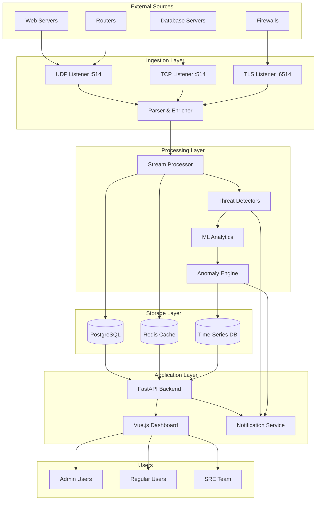
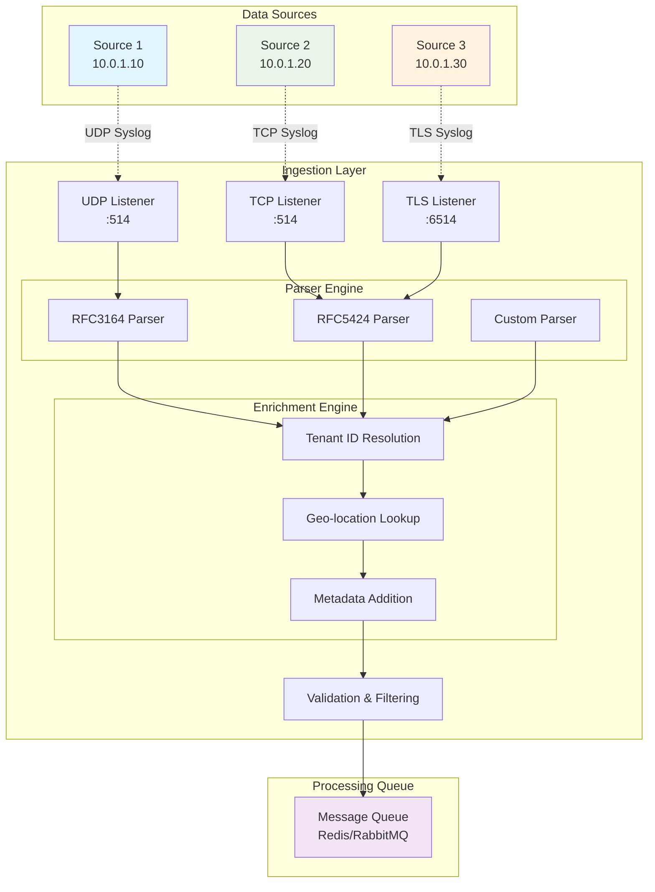
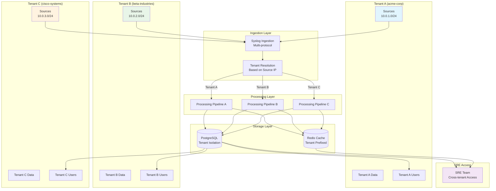
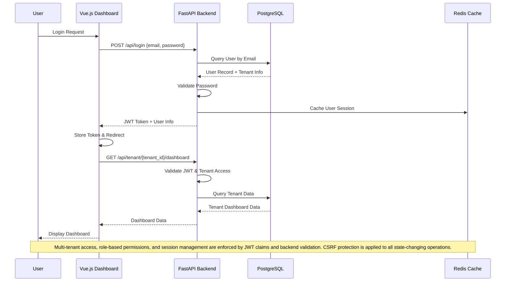
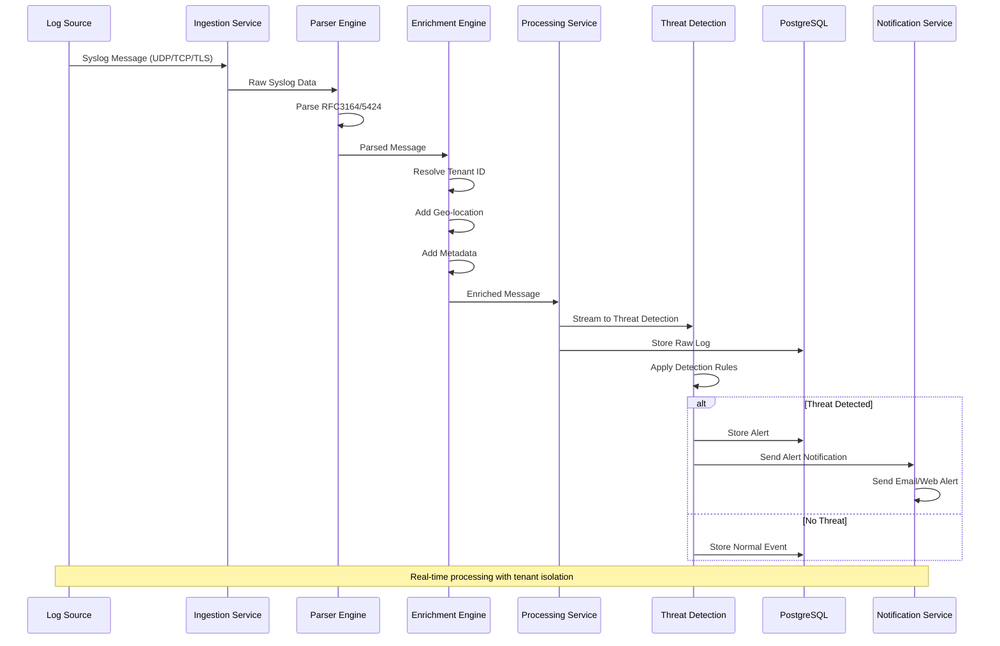
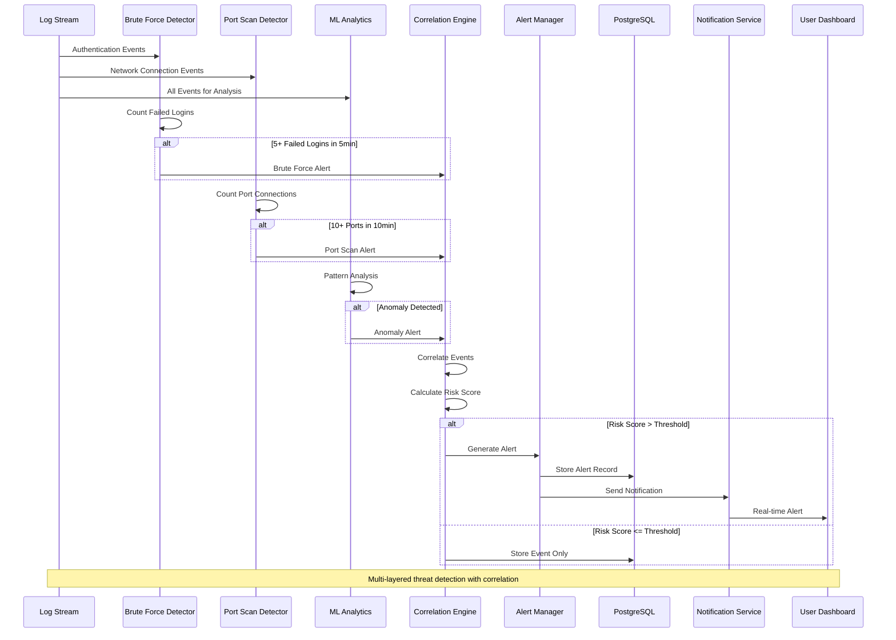
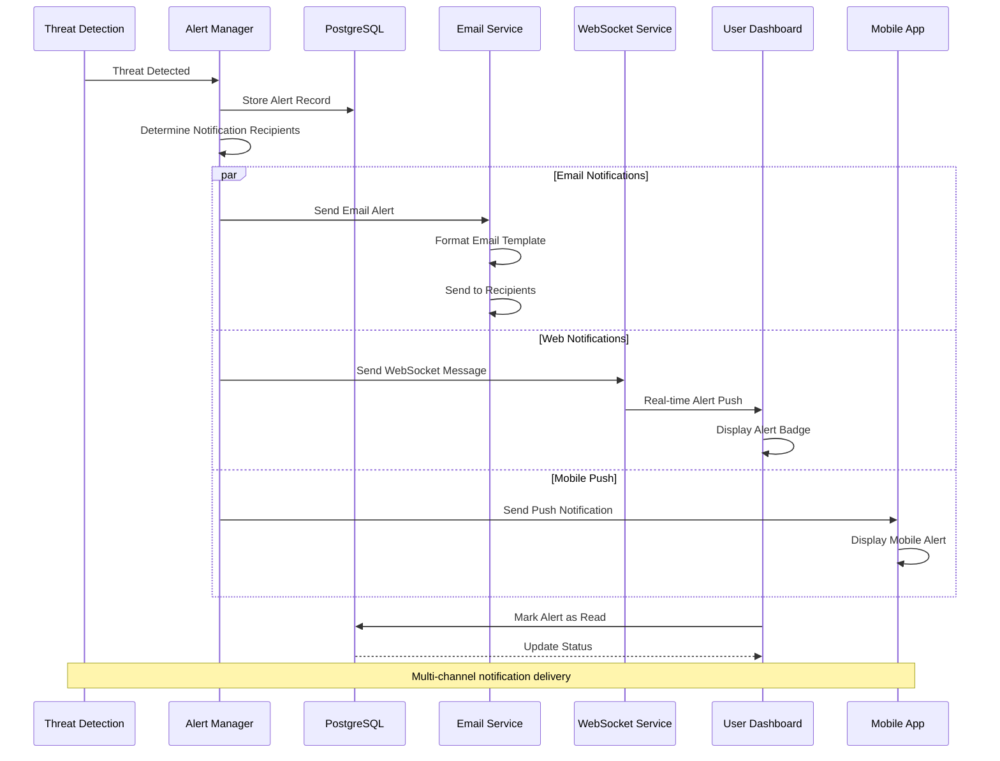

# BITS-SIEM Architecture Workflows & Sequence Diagrams


## 🏗️ System Architecture Overview

The BITS-SIEM system uses a microservices architecture with:

- **Dashboard** (Vue.js 3, Vite, Pinia, Vue Router, WebSocket): UI for registration, configuration, monitoring, alerts, multi-tenant management, and real-time notifications.
- **API** (FastAPI, SQLAlchemy, JWT, CSRF, WebSocket): Backend for tenant/user management, configuration, authentication, and alerting. Implements strict role-based access and tenant isolation.
- **Ingestion**: High-performance syslog listeners (UDP, TCP, TLS) with async Python, parsing, enrichment, and tenant resolution.
- **Processing**: Real-time analytics, ML-based anomaly detection, brute-force/port-scan/correlation engines, and alert generation.
- **Storage**: PostgreSQL for persistent, multi-tenant data storage; Redis for caching and message queueing; optional time-series DB for analytics.
- **Notification**: Email, WebSocket, and push notifications for alerts and status updates.

## 📊 Workflow Diagrams

### 1. Overall System Workflow



### 2. Syslog Ingestion Workflow



### 3. Threat Detection Workflow

```mermaid
graph TB
    subgraph "Input Stream"
        LOGS[Enriched Syslog Messages]
    end
    
    subgraph "Stream Processing"
        FILTER[Message Filtering]
        PARSE[Event Parsing]
        ENRICH[Context Enrichment]
    end
    
    subgraph "Threat Detection Engines"
        BF[Brute Force Detector<br/>5+ failed logins in 5min]
        PS[Port Scan Detector<br/>10+ ports in 10min]
        ANOM[Anomaly Detector<br/>ML-based patterns]
        CUSTOM[Custom Rules Engine]
    end
    
    subgraph "Decision Engine"
        CORRELATE[Event Correlation]
        SCORE[Risk Scoring]
        THRESHOLD[Threshold Evaluation]
    end
    
    subgraph "Response Actions"
        ALERT[Generate Alert]
        NOTIFY[Send Notification]
        BLOCK[Auto-block (Optional)]
        LOG[Log to Database]
    end
    
    LOGS --> FILTER
    FILTER --> PARSE
    PARSE --> ENRICH
    
    ENRICH --> BF
    ENRICH --> PS
    ENRICH --> ANOM
    ENRICH --> CUSTOM
    
    BF --> CORRELATE
    PS --> CORRELATE
    ANOM --> CORRELATE
    CUSTOM --> CORRELATE
    
    CORRELATE --> SCORE
    SCORE --> THRESHOLD
    
    THRESHOLD -->|Above Threshold| ALERT
    THRESHOLD -->|Below Threshold| LOG
    
    ALERT --> NOTIFY
    ALERT --> BLOCK
    ALERT --> LOG
    
    style BF fill:#ffebee
    style PS fill:#fff3e0
    style ANOM fill:#e8f5e8
    style ALERT fill:#ffcdd2
    style NOTIFY fill:#f8bbd9

    %% Notes: Brute-force and port-scan detection logic matches backend code. ML-based anomaly detection and event correlation are implemented in Python. Alerts are generated and pushed to users in real time.
```

### 4. Multi-Tenant Data Flow



## 🔄 Sequence Diagrams

### 1. User Authentication and Tenant Access



### 2. Syslog Ingestion and Processing Sequence



### 3. Threat Detection and Alerting Sequence



### 4. Real-time Notification Sequence



## 🎯 Threat Detection Use Cases Implementation

### 1. Brute Force Attack Detection

**Logic**: Multiple failed logins from same IP within time window

```python
def detect_brute_force(event):
    if event.type == "authentication_failure":
        key = f"failed_logins:{event.source_ip}"
        count = redis.incr(key)
        redis.expire(key, 300)  # 5 minute window
        
        if count >= 5:
            return create_alert(
                type="brute_force",
                severity="critical",
                source_ip=event.source_ip,
                tenant_id=event.tenant_id
            )

# Matches backend implementation: see `bruteforce_detection.py` for actual logic and alert creation.
```

### 2. Port Scanning Detection

**Logic**: Multiple connection attempts to different ports from same IP

```python
def detect_port_scan(event):
    if event.type == "connection_attempt":
        key = f"port_scan:{event.source_ip}"
        ports = redis.sadd(key, event.destination_port)
        redis.expire(key, 600)  # 10 minute window
        
        if ports >= 10:
            return create_alert(
                type="port_scan",
                severity="warning",
                source_ip=event.source_ip,
                tenant_id=event.tenant_id
            )

# Matches backend implementation: see `bruteforce_detection.py` for actual logic and alert creation.
```

## 🚀 Implementation Phases

### Phase 1: Core Ingestion Services
- Multi-protocol syslog listeners (UDP/TCP/TLS)
- Message parsing and validation
- Tenant resolution and enrichment
- Basic storage integration

### Phase 2: Processing and Analytics
- Stream processing pipeline
- Basic threat detection rules
- Alert generation and storage
- Notification integration

### Phase 3: ML-Enhanced Detection
- Anomaly detection algorithms
- Behavioral analytics
- Advanced correlation rules
- Machine learning model training

### Phase 4: Advanced Features
- Custom rule engine
- Advanced reporting
- Performance optimization
- Horizontal scaling

## 🔧 Technical Stack

### Ingestion Layer

### Ingestion Layer
- **Languages**: Python (asyncio)
- **Protocols**: UDP, TCP, TLS syslog
- **Libraries**: asyncio, socket, ssl

### Processing Layer
- **Stream Processing**: Redis Streams (default), optional Apache Kafka
- **ML Libraries**: scikit-learn, TensorFlow
- **Analytics**: Pandas, NumPy

### Storage Layer
- **Primary**: PostgreSQL (multi-tenant, SQLAlchemy ORM)
- **Cache/Queue**: Redis (caching, message queue, session store)
- **Time-series**: InfluxDB or TimescaleDB (optional)

### Integration
- **API**: FastAPI (JWT, CSRF, WebSocket, SQLAlchemy)
- **Frontend**: Vue.js 3, Vite, Pinia, Vue Router, WebSocket
- **Notifications**: Email, WebSocket, Push

### Security & Error Handling
- **Authentication**: JWT, session management, CSRF protection
- **Role-based Access**: Admin, SRE, User roles
- **Tenant Isolation**: Enforced at API and database layers
- **Error Handling**: Comprehensive backend and frontend error reporting

This architecture provides a robust, scalable, and secure SIEM solution with multi-tenant support, advanced threat detection, and real-time alerting.

## 🧪 Test Dataset & How to Run

To validate features end-to-end, a reproducible test dataset and tests are included.

### What it seeds
- Multi-tenant base data (tenants, users, sources, notifications, reports) via `api/init_database.py`
- Realistic AuthenticationEvent patterns (normal, brute-force burst, distributed failures) via `api/seed_test_data.py`
- Optional UserBehaviorBaseline construction and default DetectionRule initialization when available

### How to use
1) Ensure PostgreSQL is reachable and `DATABASE_URL` is set (see `api/alembic.ini` for example URL).
2) Initialize base data:
    - In `api/`: run `python init_database.py`
3) Seed test dataset:
    - In `api/`: run `python seed_test_data.py`
    - Or seed a single tenant: `python seed_test_data.py acme-corp`
4) Run dataset smoke tests (optional):
    - In `api/`: run `pytest -q` (requires `pytest` in `api/requirements.txt`)

The dataset covers both normal behavior and attack patterns to exercise detection and correlation logic used by the backend.
